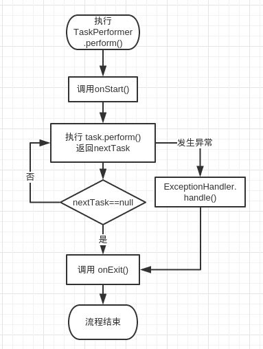

# Tasklet
------
## 简介

Tasklet是一个非常简单的任务管理工具，主要用于管理执行有先后顺序的多个任务(如刷量程序的登录->搜索->点击->下载)。
它只有4个类

* Task 抽象的任务接口，
* TaskContext 任务间上下文对象，可保存任务间共享数据
* TaskGroup 一个Task特例，逻辑上的任务组。
* TaskPerformer 核心类，任务执行入口。

## 原理

